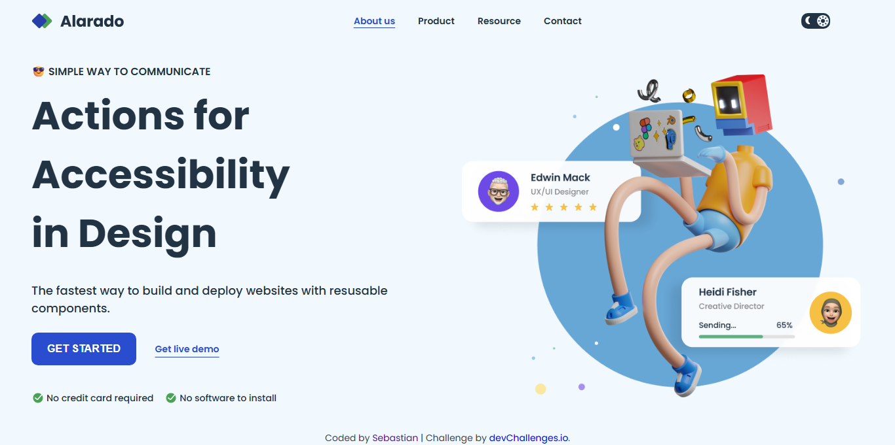

<h1 align="center">Simple Homepage | devChallenges</h1>

  Solution for the <a href="https://devchallenges.io/challenge/simple-hompage-alarado" target="_blank">Simple Homepage - Alarado</a> challenge from <a href="https://devchallenges.io" target="_blank">devChallenges.io</a>.

  <h3>
    <a href="https://simple-homepage-naitsabes.vercel.app/">Demo</a>
     | 
    <a href="https://github.com/Sebascode20/simple-homepage">Code</a>
     | 
    <a href="https://devchallenges.io/challenge/simple-hompage-alarado">Challenge</a>
  </h3>

## Table of Contents

- [Overview](#overview)
  - [What I learned](#what-i-learned)
  - [Useful resources](#useful-resources)
- [Built with](#built-with)
- [Features](#features)
- [Author](#author)
- [Acknowledgements](#acknowledgements)

## Overview

This project is an accessible, responsive landing page inspired by the devChallenges design. The page includes:

- a header with responsive navigation,
- a mobile drawer-style menu,
- a theme toggle button (light / dark mode),
- a hero section with a call to action,
- and a layout that adapts to mobile and desktop screens.

The site uses semantic HTML, modern CSS, and vanilla JavaScript to handle menu interaction and theme switching.

### What I learned

- how to build an accessible mobile navigation using a hidden checkbox and CSS,
- how to implement a theme toggle with JavaScript and update styles dynamically,
- how to use CSS variables to keep colors and states consistent,
- how to create a responsive layout with Flexbox and media queries,
- how to preserve a clean and simple user experience across different screen sizes.

### Useful resources

- [devChallenges.io](https://devchallenges.io/) - original challenge and design reference.
- [MDN Web Docs](https://developer.mozilla.org/) - documentation for HTML, CSS and accessibility.

## Built with

- HTML5
- CSS3
- CSS custom properties
- Flexbox
- Vanilla JavaScript

## Features

- responsive design for mobile, tablet, and desktop,
- collapsible navigation menu on small screens,
- light/dark theme toggle with sun and moon icons,
- optimized images and lazy loading (`loading="lazy"`),
- readable typography with clear visual hierarchy,
- basic accessibility support using semantic tags and image alt text.

## Author

- Name: Sebastian
- GitHub: [@Sebascode20](https://github.com/Sebascode20)

## Acknowledgements

- devChallenges for the challenge and design reference.
- the developer community for sharing design and accessibility resources.

